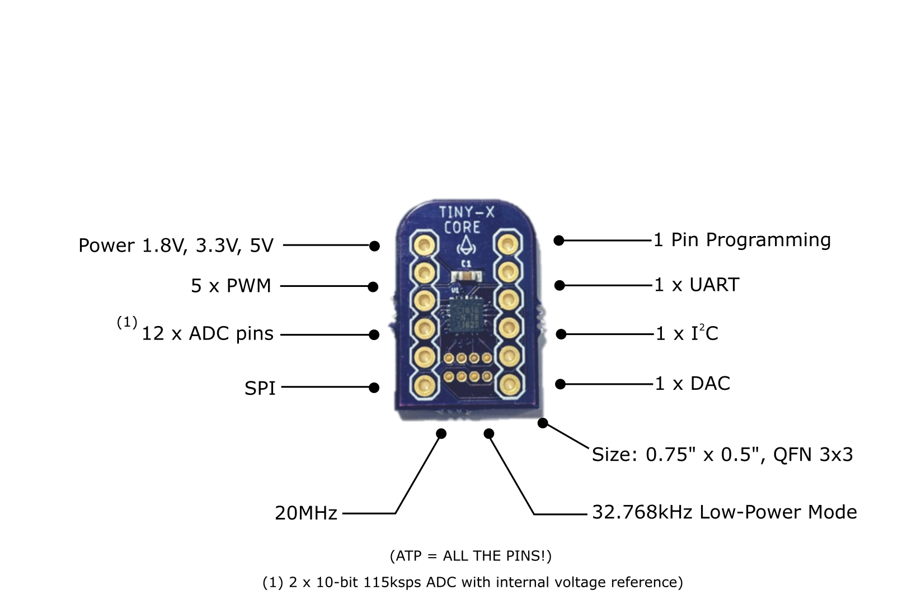
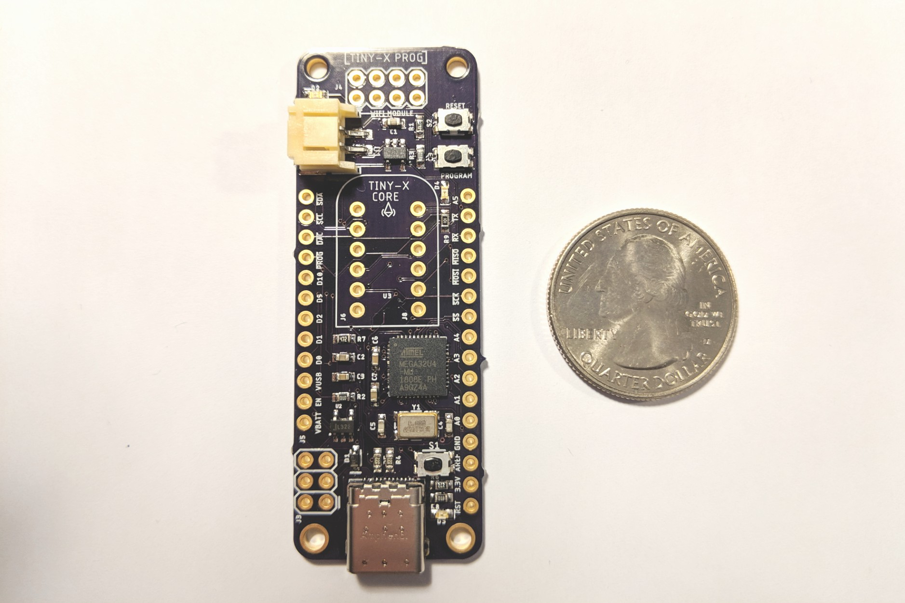

## Introduction

Open source Arduino supported Attiny1616 / Attiny3217 breakout board with Programmer. It is small, easy to use and low power consumption. **It has I2C, SPI, UART, PWM, Timers, Touch PINS, ADC, DAC, 16K Flash, 2K SRAM, 256 bytes EEPROM with 8-bit CPU running up to 20MHz all in it's tiny body!** It has the smallest possible bread-board footprint. The programmer boards features USB type-c, JST battery and ESP-01 connectors.

They are avaialbe on Tindie.

- [TinyCore 16 - Attiny1616](https://www.tindie.com/products/16834/)

- [TinyCore 32 - Attiny3217](https://www.tindie.com/products/17279/)

- [TinyCore Programmer](https://www.tindie.com/products/16835/)

- [Documentation](https://docs.tinycore.dev/en/latest/)

- [Source Code](https://github.com/xukangmin/TinyCore)

**(Warning: TinyCore 16/32 board has no bootloader, it can only be programmed through programmers.)**

## Tiny Core 16

## Tiny Programmer

- USB type C connector
- JST Battery connector
- ESP-01 connector for IoT applications

## DEMO (Check [Documentation Site](https://docs.tinycore.dev) for Code & Tutorial)

### Breathing LED:

<iframe width="853" height="480" src="https://www.youtube.com/embed/t7WcHrdrQLk?rel=0;&mute=1&loop=1" frameborder="0" allow="accelerometer; encrypted-media; gyroscope; picture-in-picture" allowfullscreen></iframe>

### Neo Pixel String

<iframe width="853" height="480" src="https://www.youtube.com/embed/jilxpWxtArI?rel=0;&mute=1&loop=1" frameborder="0" allow="accelerometer; encrypted-media; gyroscope; picture-in-picture" allowfullscreen></iframe>

### I2C communication

### E-INK with ESP8266

<iframe width="853" height="480" src="https://www.youtube.com/embed/GgDZX_R0gxE?rel=0;&mute=1&loop=1" frameborder="0" allow="accelerometer; encrypted-media; gyroscope; picture-in-picture" allowfullscreen></iframe>

## Contact
For any questions & suggestions, please send email to [xukangmin@gmail.com](mailto:xukangmin@gmail.com)