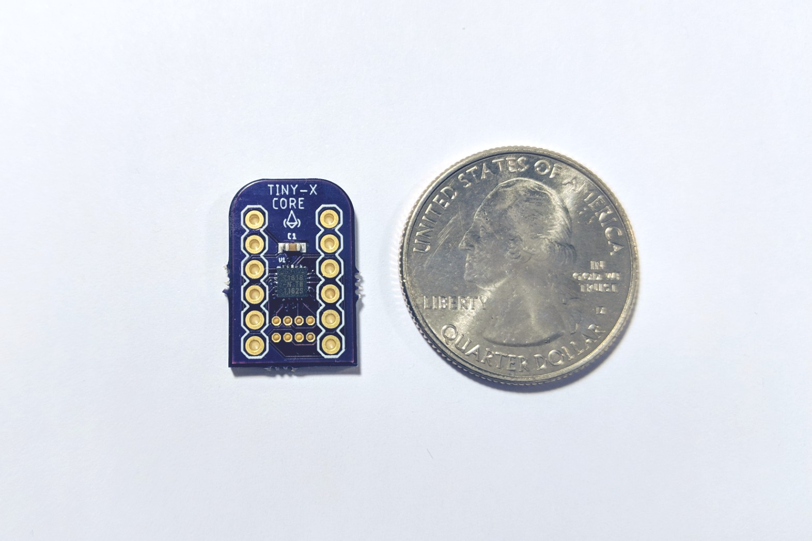
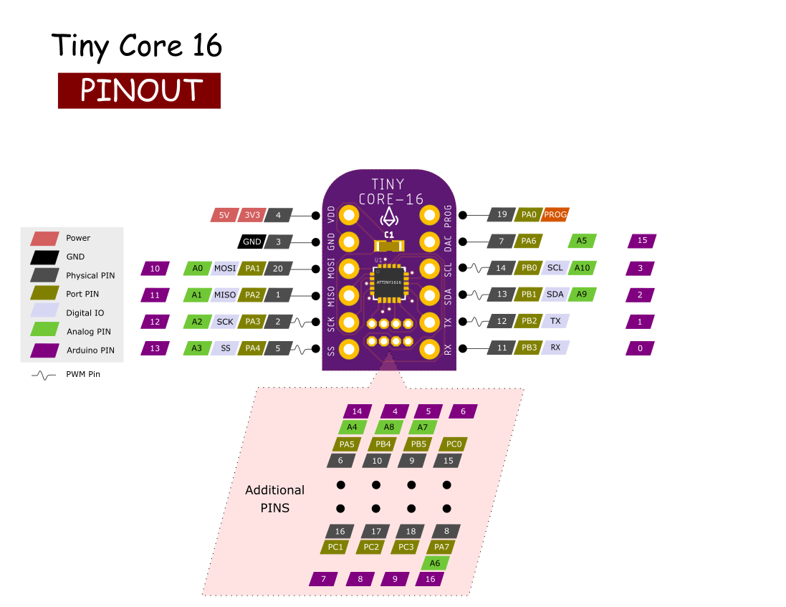

Tiny Core Boards are based on Attiny 1 series boards with smallest possible footprint breakout boards and programmer board. The programmer boards features USB type-c, JST battery and ESP-01 connectors.

They are avaialbe on Tindie.

- [TinyCore 16 - Attiny1616](https://www.tindie.com/products/16834/)

- [TinyCore Programmer](https://www.tindie.com/products/16835/)

**(Warning: TinyCore 16 board has no bootloader, it can only be programmed through programmers.)**

## Tiny Core

 Specifications |  .
------------ | -------------
Flash (program memory)   | 32/16 KB
RAM  | 2 KB
EEPROM | 256 bytes
Bootloader | No
GPIO Pins | 18
ADC Channels | 10
PWM Channels | 3
Peripheral | USART, SPI, I2C, Touch
Clock | 20 MHz
Power Consumption | min 2.9μA, max 10mA


Tiny Core 16 board:




Powering Neopixel String:


I2C communication


## Tiny Programmer

- USB type C connector
- JST Battery connector
- ESP-01 connector for IoT applications


### Installation
- Install the current upstream Arduino IDE at the 1.8.7 level or later. The current version is at the [Arduino website](http://www.arduino.cc/en/main/software).
- Start Arduino and open Preferences window.
- Enter ```https://raw.githubusercontent.com/xukangmin/TinyCore/master/avr/package/package_tinycore_index.json``` into *Additional Board Manager URLs* field. You can add multiple URLs, separating them with commas.
- Open Boards Manager from Tools > Board menu and install *TinyCore* platform (and don't forget to select your TinyCore board from Tools > Board menu after installation).

### Arduino Support
  Currently UART, I2C, SPI, basic timer functions like delay, delayMicroseconds, milis, micros are working, I'm working on adding EEPROM support.


### Pin Mapping

